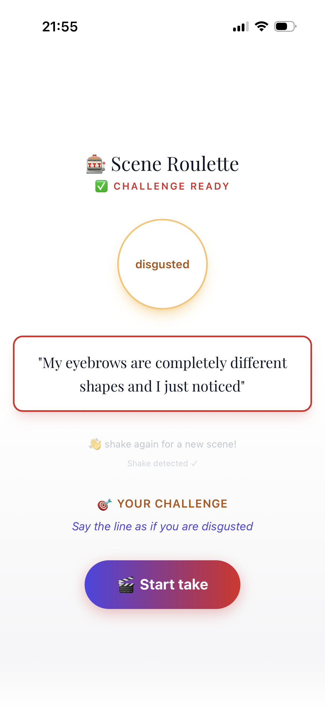
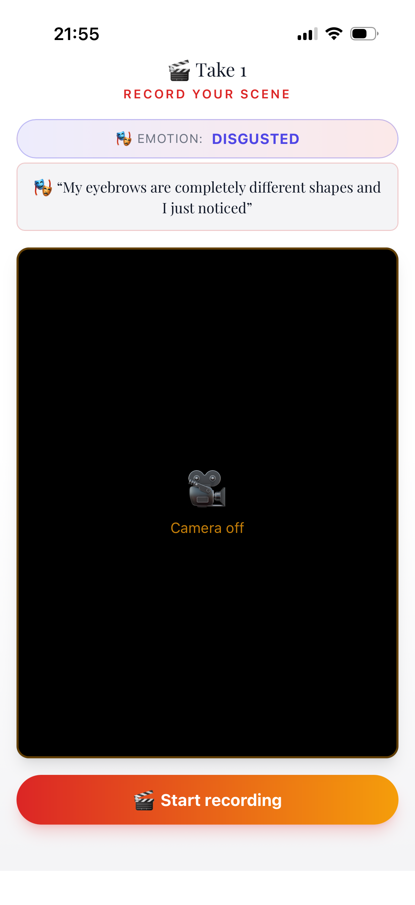
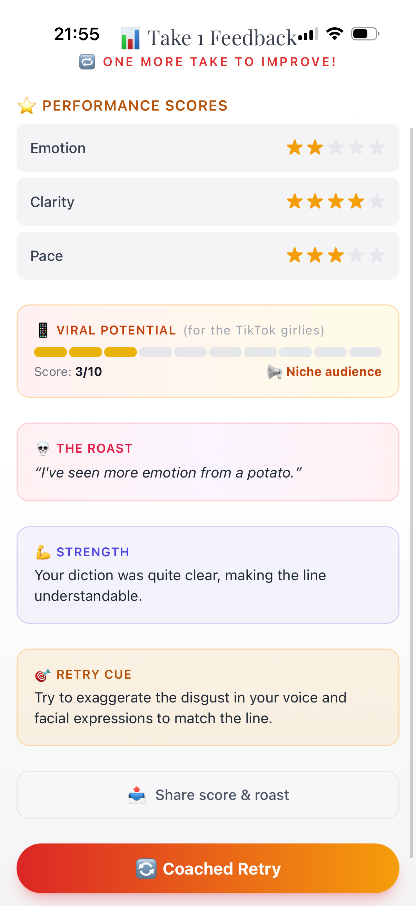

# 🦵 brAIk-a-leg — Scene Roulette

> ⚡ **Vibe coded** in 3 hours at a local hackathon.  
> **Use case:** AI coach for theater actors — spin a random scene, record a take, get scored by GPT-4o-mini.

---

## Screenshots

| 🎰 Spin a scene | 🎥 Record your take | 🤖 Get feedback |
|:---:|:---:|:---:|
|  |  |  |

---

## How it works

🎰 **Roulette** — spin a wheel for a cursed line + a target emotion (shake your phone to re-spin)  
🎥 **Record** — 5-second take, front camera, auto-stop  
🤖 **Feedback** — AI scores emotion/clarity/pace, roasts you, then gives a coached retry cue  
🔄 **Retry** — second take with score deltas, then back to a new scene

---

## Quick start

```bash
npm install
cp .env.example .env.local
npm run dev
# open http://localhost:3000
```

For real AI (optional), set `NEXT_PUBLIC_OPENAI_API_KEY` in `.env.local`.  
Without it, the app falls back to mock feedback — fully functional.

---

## Built with

Next.js 14 · Tailwind CSS · OpenAI (gpt-4o-mini + whisper) · PWA · sessionStorage  
Zero backend. Runs entirely in the browser.

## License

Private — hackathon submission.
